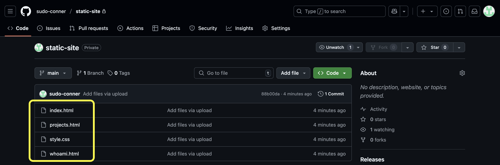
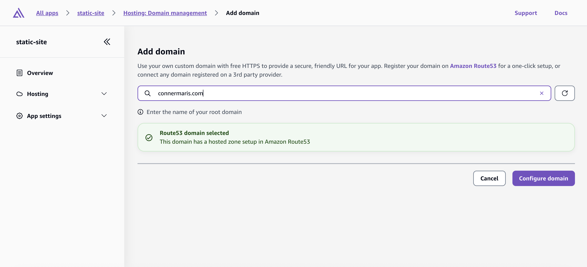

# Hosting a Static Site on AWS

## Table of Contents

- [Summary](#summary)
- [Tools & Technologies](#tools--technologies)
- [Setup](#setup)
- [Challenges & Lessons Learned](#challenges--lessons-learned)
- [References](#references)

## Summary

AWS offers several methods to host your website. One of the simplest options is hosting a static site using **Amazon S3**, their cloud storage service available on a pay-as-you-go basis. By uploading HTML files to an S3 bucket and configuring permissions for public GET requests, your site can be live in minutes.

However, hosting exclusively with S3 requires you to manually manage important features like HTTPS, CDN integration, and deployment automation.

**AWS Amplify** bundles all these features into one streamlined service. Amplify allows you to easily build and deploy web applications directly to Amazon’s global CDN. It integrates seamlessly with Git, automatically rebuilding and deploying your app each time your repository is updated. Additionally, HTTPS support and custom domain management are simplified, and security is enhanced since your content is served securely through CloudFront, rather than directly from your S3 bucket.

> The rest of this write-up will show the steps I took to deploy my personal website. Go check it out if you haven't already. [Conner's Website](https://connermaris.com)

## Tools & Technologies

Before setting up an Amplify app make sure you have:

* AWS Account
* Custom Domain
* GitHub Account / Repo for the Site

## Setup

First create a private repo and upload site files

Verify Route 53 hosted zone has NS and SOA records

Go to Amplify and select 'Create new app'

Select GitHub, or another git provider

Log into GitHub at the prompt and give Amplify permission to view the repo

Add the repo to the app

Give the Amplify app a name

Review settings and **deploy!**

Once the site is deployed it can be accessed from it's `.amplifyapp.com` address

Here it is!

Now for the custom domain

Select `Add custom domain` 

Search for the domain and click `Configure domain`

Defaults configure the `www.` subdomain and `Amplify managed certificate`

**Proceed** and Amplify creates and configures SSL certs and the domain

When all the checkmarks are **green**, configuration is complete!

After a couple minutes, DNS will propogate and the site can be reached by the custom domain name [connermaris.com](https://connermaris.com)

That's it! Now code can be updated in a **local IDE**, pushed to **GitHub**, and deployed by **Amplify** automatically. All while being served securely over Amazon's **CloudFront** CDN using a custom domain name.

## Challenges & Lessons Learned

Interestingly, the biggest challenges I encountered with this project began before I even decided to deploy my static site to Amplify. Originally, my portfolio website was hosted using **WordPress** on **AWS Lightsail**. Lightsail is a great service and WordPress offers plenty of functionality, but both were overkill for my simple portfolio.

Setting up server-side software such as Fail2Ban, automating Let's Encrypt certificate renewals, and keeping the underlying infrastructure updated quickly became tedious. Additionally, my WordPress setup lacked a CDN, and maintaining the server took time away from actually getting what I wanted out of my website. I found myself avoiding site updates altogether. Turns out managing a full server stack simply wasn't aligned with my real goal: having a secure, straightforward landing page for my projects and LinkedIn profile.

By transitioning to static HTML hosted with **AWS Amplify**, I learned an important lesson about deploying only what's needed to achieve your goals. While IT systems must be secure, they also need to be practical and maintainable. Amplify provided exactly the simplicity, security, and manageability I was seeking, without unnecessary overhead.

It seems that even when you're your own end-user, accurately gauging needs and user acceptance isn't always straightforward.  ¯\\\_(ツ)_/¯  Initially, I selected Lightsail because it seemed simpler than EC2; later, S3 static hosting appeared to be a better fit, until I learned about Amplify, which became my ideal solution. Technology solutions can only evolve as far as our own understanding.

Perhaps someday I'll discover an even better solution for deploying a static website, but for now, I'm quite happy with Amplify.

Thanks for joining me on this—I hope you've found some valuable insights with me

## References

* [Hosting a static website using Amazon S3](https://docs.aws.amazon.com/AmazonS3/latest/userguide/WebsiteHosting.html)

* [Welcome to AWS Amplify Hosting](https://docs.aws.amazon.com/amplify/latest/userguide/welcome.html)
